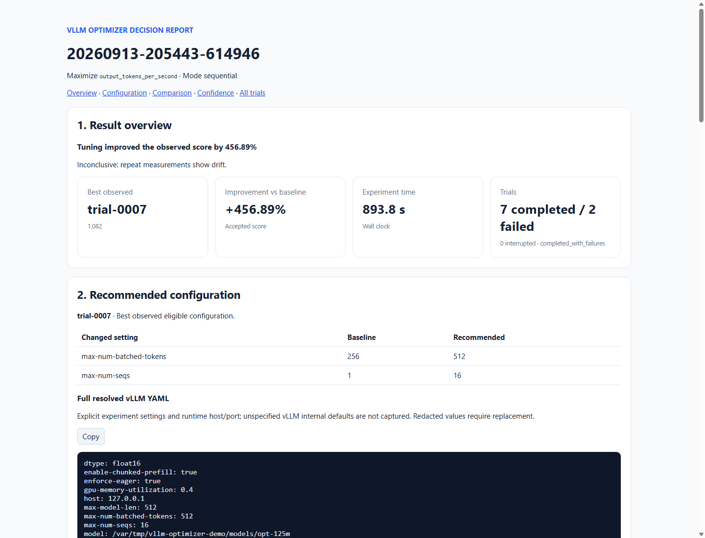

# RTX 3080 local results

These are real inference measurements from one **RTX 3080, 10 GiB**, running
Ubuntu under WSL2. The runs started on 13 September 2026 UTC. Use this checkout
and the [unchanged experiment files](../../experiments/README.md) for the H100
rerun; each result includes the SHA-256 of the exact YAML that was executed.

## Report showcase

[Open the full interactive report](report-showcase/report.html).



The accepted configuration changes `max-num-seqs` from **1 to 16** and
`max-num-batched-tokens` from **256 to 512**. The configured score increased
from **194.34 to 1,082.27 output tokens/s (+456.89%)**. This score is the mean
of the two named workloads' repeat medians; their individual measurements and
latency percentiles remain separate in the report.

The experiment took **893.83 seconds**: seven trials completed, including the
baseline, and two deliberately invalid configurations failed. Both finalists
were validated again, and the accepted ranking uses those validation results.
The intentionally zero drift threshold makes the confidence verdict
**inconclusive due to drift**, despite the large observed improvement.

- [Exact experiment](report-showcase/experiment.yaml)
- [CSV](report-showcase/results.csv) and [structured result](report-showcase/result.json)
- [Provenance and checksums](report-showcase/provenance.json)
- [Complete evidence archive](report-showcase/evidence.zip)

## Baseline control

[Open the baseline-control report](baseline-control/report.html).

This experiment starts with `max-num-seqs: 16` and tests a restricted candidate
with `max-num-seqs: 1`; both retain `max-num-batched-tokens: 512`.
The **baseline wins** at **925.54 output tokens/s**, versus **205.87** for
the candidate (**-77.76%**). The report recommends keeping the baseline with
no changed settings. Both trials completed without request failures in
**92.22 seconds**. With three repeats, drift assessment is unavailable.
The structured result's `best` field identifies the best search candidate;
the HTML compares that candidate with the separately stored baseline.

- [Exact experiment](baseline-control/experiment.yaml)
- [CSV](baseline-control/results.csv) and [structured result](baseline-control/result.json)
- [Provenance and checksums](baseline-control/provenance.json)
- [Complete evidence archive](baseline-control/evidence.zip)

## Workloads and interpretation

| Workload | Dataset | Input / output tokens | Requests per repeat | Concurrency | Request rate |
| --- | --- | --- | --- | --- | --- |
| short-chat | Seeded random | 64 / 32 | 16 | 8 | Unlimited |
| longer-prompt | Seeded random | 256 / 64 | 16 | 8 | Unlimited |

The showcase measures both workloads with four repeats each; the control uses
short-chat with three repeats. Every named workload has one excluded warmup.
The model is the pinned `facebook/opt-125m` revision recorded in the shared
recipes. The runtime is Python 3.12.3, vLLM 0.28.0, PyTorch 2.13.0/CUDA 13.0,
and driver 616.64. Complete package pins and model checksums are provided.

These deliberately small experiments exercise the five priority report
sections, supplied P50/P95/P99 metrics, baseline retention, validation history,
and failure diagnostics. They do not establish production performance or H100
speedups. Total per-trial runtime and other uncaptured fields remain unavailable.
The restricted showcase baseline is a demonstration choice.

## Inspect or regenerate

The HTML is self-contained and opens directly after downloading. The ZIP
contains the run directory, accepted and initial trial results, manifests,
raw benchmark output, and diagnostic logs. It contains no model weights.

Personal paths and GPU UUIDs were redacted in the public copy. Artifact paths
and checksums were updated accordingly; scores, request counts, measurements,
and statuses were not changed. Untouched source artifacts were retained
privately, and their hashes are recorded in `provenance.json`.

For offline integrity checks, extract each archive into the
`restoration_directory` recorded in its provenance, preserving the timestamped
run directory, then run:

```bash
vllm-opt report --run /var/tmp/vllm-optimizer-demo/public/report-showcase/20260913-205443-614946
```

Opening the HTML alone does not require restoring paths or installing vLLM.
No results in this folder have been measured on H100; that archive remains
[explicitly pending](../h100/index.md).
